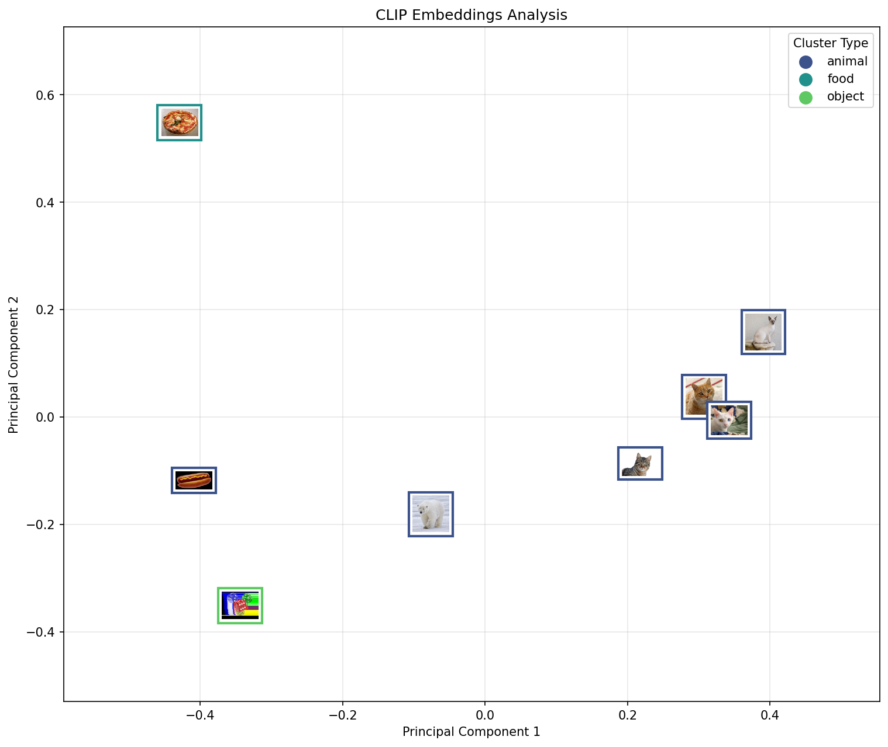

# Exploring Image Embeddings with CLIP: A Beginner's Guide

This report dives into the fascinating world of **CLIP (Contrastive Language-Image Pre-training)**. We will explore how to use this powerful model to understand images, decompose their features, and visualize relationships between them.

This guide is designed for those new to machine learning who want to see code in action. We'll walk through the entire process step-by-step using Python.

## What is CLIP?

CLIP is a neural network trained by OpenAI on a massive dataset of text and images. Unlike traditional computer vision models trained to recognize specific categories (like "cat" or "dog"), CLIP learns to associate images with natural language descriptions. This allows it to generate rich numerical representations, called **embeddings**, for any image.

These embeddings capture the "semantic meaning" of an image. If two images are similar in content or context, their embeddings will be close to each other mathematically.

## The Pipeline

Our analysis pipeline consists of 4 main steps:
1.  **Loading the Model**: Setting up CLIP.
2.  **Generating Embeddings**: Converting images into vectors (lists of numbers).
3.  **Decomposition (PCA)**: Simplifying these high-dimensional vectors to 2 dimensions so we can see them.
4.  **Clustering & Naming**: Grouping images and using CLIP to automatically name the groups.
5.  **Visualization**: Plotting the results with the original images.

---

### Step 1: Setup and Loading the Model

First, we need to import our tools and load the pre-trained CLIP model from the Hugging Face `transformers` library.

```python
import matplotlib.pyplot as plt
import numpy as np
import requests
import seaborn as sns
import torch

from io import BytesIO
from matplotlib.offsetbox import OffsetImage, AnnotationBbox
from PIL import Image
from sklearn.decomposition import PCA
from sklearn.cluster import KMeans
from transformers import CLIPProcessor, CLIPModel

def load_clip_model():
    print("Loading CLIP model...")
    # We use the 'base' model which is a good balance of speed and performance
    model = CLIPModel.from_pretrained("openai/clip-vit-base-patch32")
    processor = CLIPProcessor.from_pretrained("openai/clip-vit-base-patch32")
    return model, processor
```

*   **`CLIPModel`**: The neural network itself.
*   **`CLIPProcessor`**: A helper tool that prepares our images (resizing, normalizing) so the model can understand them.

### Step 2: Preparing the Data

We'll download a few sample images from the web. We use standard libraries like `requests` and `PIL` (Python Imaging Library) to handle the downloads.

```python
def get_sample_images():
    urls = [
        "https://upload.wikimedia.org/wikipedia/commons/thumb/3/3a/Cat03.jpg/1200px-Cat03.jpg", # Cat
        "https://upload.wikimedia.org/wikipedia/commons/thumb/6/66/Polar_Bear_-_Alaska_%28cropped%29.jpg/1200px-Polar_Bear_-_Alaska_%28cropped%29.jpg", # Polar Bear
        "https://upload.wikimedia.org/wikipedia/commons/thumb/b/b1/Hot_dog_with_mustard.png/1200px-Hot_dog_with_mustard.png", # Hot dog
        # ... more images ...
    ]

    images = []
    headers = {
        'User-Agent': 'Mozilla/5.0 (Windows NT 10.0; Win64; x64) AppleWebKit/537.36 (KHTML, like Gecko) Chrome/91.0.4472.124 Safari/537.36'
    }
    for url in urls:
        try:
            response = requests.get(url, headers=headers, stream=True)
            response.raise_for_status()
            img = Image.open(BytesIO(response.content)).convert("RGB")
            images.append(img)
        except Exception as e:
            print(f"Error downloading {url}")

    return images
```

### Step 3: Generating Image Embeddings

This is the magic step. We pass our images through the CLIP model. The model outputs a vector (a list of 512 numbers) for each image. This vector represents the image's content.

```python
def get_image_embeddings(model, processor, images):
    # 1. Process images (resize, normalize)
    inputs = processor(images=images, return_tensors="pt", padding=True)

    # 2. Pass through model to get features
    with torch.no_grad():  # We don't need gradients for inference, saves memory
        image_features = model.get_image_features(**inputs)

    # 3. Normalize embeddings
    # This makes comparing them easier (cosine similarity)
    image_features = image_features / image_features.norm(p=2, dim=-1, keepdim=True)
    return image_features.numpy()
```

### Step 4: Decomposing with PCA

The embeddings are 512-dimensional. We can't visualize 512 dimensions on a 2D screen!

We use **PCA (Principal Component Analysis)** to reduce this complexity. PCA finds the "directions" (components) in the data that contain the most information (variance) and squashes the data down to just 2 dimensions (x and y) while keeping as much structural info as possible.

```python
def decompose_embeddings_pca(embeddings, n_components=2):
    pca = PCA(n_components=n_components)
    reduced_embeddings = pca.fit_transform(embeddings)
    return reduced_embeddings, pca
```

### Step 5: Clustering and Semantic Naming

Here is where CLIP shines. We first group the images using K-Means, just like standard machine learning. But then, we use CLIP's **text understanding** to automatically figure out what those groups represent.

#### How Semantic Naming Works:

1.  **Cluster Centers**: K-Means gives us a "center point" (centroid) for each group of images. This center represents the "average" concept of that group.
2.  **Candidate Labels**: We provide a list of potential words, like `["animal", "food", "object", "vehicle"]`.
3.  **Text Embeddings**: We feed these words into CLIP to get their vector representations (just like we did for images).
4.  **Similarity Match**: We calculate the similarity (dot product) between each **Cluster Center** and each **Word Embedding**.
5.  **Label Assignment**: The word that is mathematically closest to the cluster center becomes the name of that cluster.

For example, if a cluster contains cats and bears, its center will be mathematically close to the word "animal".

```python
def name_clusters(model, processor, kmeans, candidate_labels):
    # 1. Get embeddings for our list of words
    inputs = processor(text=candidate_labels, return_tensors="pt", padding=True)
    with torch.no_grad():
        text_features = model.get_text_features(**inputs)
    text_features = text_features / text_features.norm(p=2, dim=-1, keepdim=True)  # Normalize

    # 2. Get the mathematical center of each image cluster
    cluster_centers = torch.tensor(kmeans.cluster_centers_)
    cluster_centers = cluster_centers / cluster_centers.norm(p=2, dim=-1, keepdim=True)  # Normalize

    # 3. Compute similarity (Dot Product)
    # Result is a matrix of scores: [Number of Clusters] x [Number of Labels]
    similarity = (cluster_centers @ text_features.T).numpy()

    # 4. Find the best match
    cluster_names = {}
    for i in range(len(cluster_centers)):
        best_label_idx = np.argmax(similarity[i])
        cluster_names[i] = candidate_labels[best_label_idx]

    return cluster_names
```

### Step 6: Visualization

Finally, we use `matplotlib` to plot our 2D points. Instead of just dots, we plot the actual images as thumbnails so we can see exactly how they are grouped. We color the borders of the images based on their cluster.

(See `visualize_results` in the full script for the implementation details using `AnnotationBbox`).



### Analyzing the Result

The image above shows the output of our analysis. Here's what we can observe:

1.  **Clustering**: The algorithm automatically grouped the images into distinct categories.
    *   **"Animal" Cluster (Purple)**: Contains the cats and the polar bear.
    *   **"Food" Cluster (Green)**: Contains the pizza.
    *   **"Object" Cluster (Yellow)**: Contains the dice.
2.  **Semantic Positioning**:
    *   The **Hot Dog** (bottom left) is particularly interesting. It is visually located between the "Food" cluster and the "Animal" cluster.
    *   While it is definitely food, CLIP's language understanding knows that the word "Hot Dog" contains the word "Dog" (an animal). This dual meaning or linguistic connection might influence its positioning in the embedding space, showing how CLIP bridges the gap between visual appearance and language semantics.

## Conclusion

By following this pipeline, we've taken raw pixels, converted them into semantic meaning (embeddings), simplified that meaning (PCA), and discovered patterns (Clustering).

The most powerful part is that **we didn't train a model to recognize these specific images.** CLIP already "knew" what a hot dog and a cat looked like because of its massive pre-training. We just used its internal knowledge to organize our own data.

If you run the provided `clip_analysis.py` script, you will see how CLIP naturally separates different concepts—grouping animals together, food together, etc.—without us ever explicitly telling it what a "cat" or "hot dog" looks like.
